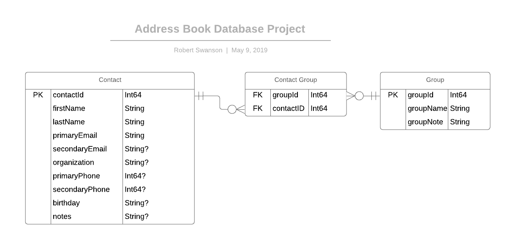
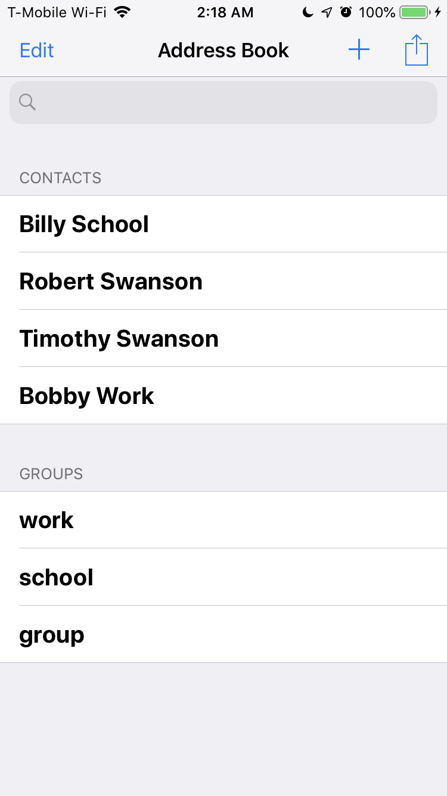
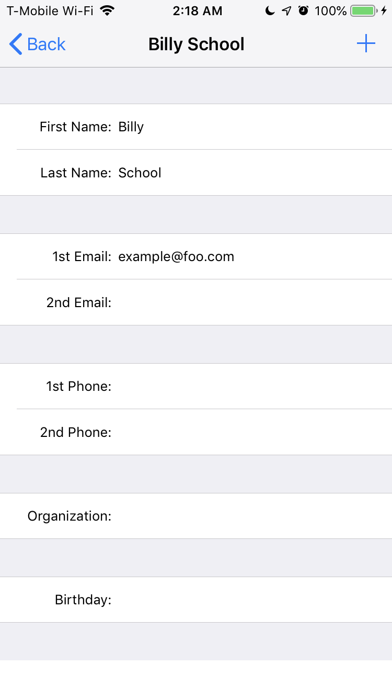

# Address Book Database Project
*Written in Swift for IOS by Robert Swanson*
## Description
This app servees as a contacts application that can store certain data about individuals. This app allows for adding, deleting, editing, grouping, and searching of contacts.

## Instructions
The application displays both contacts and groups on the main view, allowing for the user to select or delete any. If the user selects a contact, they are brought to another view, where they can view and edit the contacts information, including the groups they are in. If the user selects a group in the main view, they are informed what contacts are part of that group.

**EDR describing database structure**

