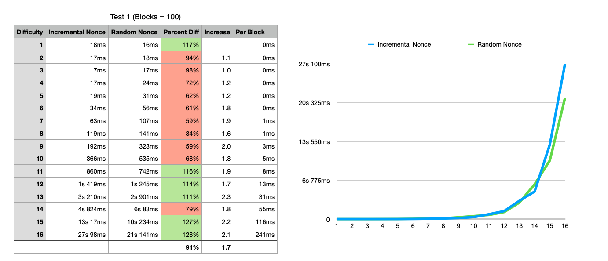

# Blockchain Runtime Analysis

For my tests, I instructed the program to create 100 blocks at difficulty ranges 1-16. I tested the program both with incremental nonces and randomly generated nonces, and laid out the percent difference between them. I also displayed the increase in run time from one difficulty to the next.

Just as expected, the data revealed exponential growth in runtime as the hash check difficulty increased. Also, just as we would expect, there was no certain winner between random and incremental nonce creation, though the adjacency of trends did lead me to run the tests again, but I found no such pattern in the second run. The runtime increased by a factor of around 1.7, which is close but not precisely the expected factor of 2.

As for calculating the difficulty required to make a block calculation take about 10 minutes, I’d start with the knowledge that my blocks generated with 16 difficulty took on average 241ms. And since $.241*2^{11}=493$, I would expect a difficulty of $16+11=27$ to result in around 10 minutes proof of work.

