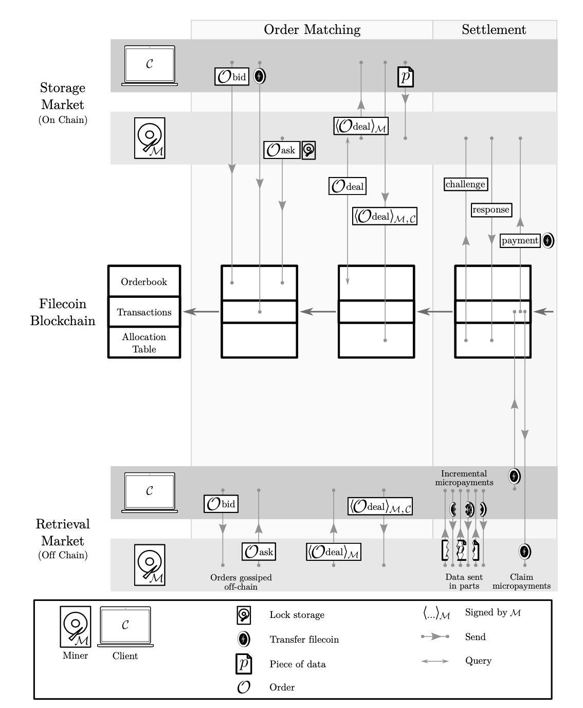

# ⨎ Filecoin Paper

*Robert Swanson*

Centralized cloud services currently dominate the data storage market. Website data, personal documents, and data bases are increasingly being sourced to companies such as Amazon Web Services (AWS) and Microsoft Azure. This centralization of data leads to problems present in other forms of centralization: controlled access, single points of failure, and monopolies. [Filecoin](https://filecoin.io) (⨎) is a project that aims to resolve these problems by decentralizing data storage in such a way that allows for data storage free of operate control. Filecoin also takes advantage of its decentralized nature and supply and demand model of distribution to offer competitive prices, geographically closer points of data origin, and mechanisms for data integrity.

Filecoin is being developed by [Protocol Labs](https://protocol.ai) (PL) which was founded by  Juan Benet in 2014. Their [whitepaper](https://filecoin.io/filecoin.pdf) was originally written in 2014 and has been cumulatively worked on since. PL developed file coin and the **i**nter**p**lanetary **f**ile **s**ystem (IPFS) protocol concurrently, since file coin works on top of IPFS. Investors include BlueYard Capital, Digital Currency Group, Union Square Ventures, and Winklevoss Capital ([AXIOS](https://www.axios.com/filecoin-blockchain-delay-3b5e6b9a-bcc8-41cf-81cf-563f6cebb2c4.html)). The governance of Filecoin is overseen by the [Filecoin Foundation](https://filecoin.io/blog/posts/meet-the-filecoin-foundation/) and improvements must follow the [Filecoin improvement protocol](https://github.com/filecoin-project/FIPs/blob/master/README.md).

## Technology

The Filecoin network is built on **IPFS** which lays out the protocol for how a decentralized file system works, and defines the Interplanetary Linked Data (IPLD) ecosystem for decentralized storage and access of data. Unlike the HTTP protocol, which identifies files by their location IPLD identifies files by a content ID (CID). The CID is composed of a codec and a multi hash of the file. This multi-hash allows for compatibility with any kind of file hash, and thus allows for file access by a hash rather than by file location. This allows for a client to abstract away the server of data, and focus instead on the data itself.

### Storage Market

While IPFS implements the file system, and can be used on its own, it lacks any incentive for people to operate IPFS nodes. This is the function of Filecoin, to create a competitive market for data storage. The Filecoin token serves as the reward for node operators, and the cost of network users. The protocol defines a blockchain that records three items relating to the negotiation of Filecoin deals.

First, the blockchain records the order book, which is responsible for maintaining a competitive market for data storage. The order book allows for anyone to place a bid for a given amount of space (pledge sector) and is linked with an offer amount (in Filecoin). In the same manner, operators/miners can place ask offers on the order book, which ask for a certain price for a given amount of space. Miners are responsible for matching a bid and creating and signing a deal, which is sent to the client, who signs it, and and then sends it to the blockchain.

Secondly, the blockchain records all Filecoin transactions. Such transactions take place when a bid is made (client payment), and when a miner proves that they have stored data. Normal Filecoin transfer can also happen just like any other transferrable cryptocurrency.

Finally, the blockchain records a file allocation table, which links content IDs to the location of the data. This includes geographic location, so that that IPFS can connect clients to the nearest available instance of the data they’re interested in.

### Retrieval Market

While the storage market is mediated by the blockchain ledger, the retrieval market occurs almost completely without the mediation of the blockchain. In this case, bids are made and matched off-chain (gossiped as the white paper put it). Deals are conducted between the client and the miner, and the blockchain is only consulted to record the transfer of Filecoin. This transfer happens in fragments, as the the file is transferred to the client.

### Mining

One of Filecoin’s intentional differences in design, is that mining is said to be useful in contrast to proof of work mechanisms (such as that used by Bitcoin). Rather than mining to maintain consensus, Filecoin mining occurs through a process of selecting a network node to create a block which can include the mining reward. The node creator is selected through a process that results in likelihood of selection being proportional to the proof-of-spacetime for a given node. In other words, miners who are actively storing more data are more likely to mine the block.

The filecoin protocol depends on two kinds of proofs: proof-of-replication and proof-of-spacetime. Proof-of-replication is a response to three malicious attacks miners could execute to cheat the system which are described in the white paper. It assures both clients and the system that miners are storing a certain amount of data, and with a certain number of replicas. Proof of spacetime is a kind of proof-of-storage that extends to prove that the data is actively being stored on the miner.

The blockchain uses a collision Merkel resistant hash function (MerkleCRH) to ensure cryptographic integrity of the blockchain record. It also uses Zero-Knowledge Succinct Non-Interactive Arguments of Knowledge (zk-SNARK). What this means is that any entity on the network is able to challenge a miner to prove that it is storing data, without knowing *what* that data is, but can efficiently prove that the miner has maintained integrity of the data.

 

## Legal and Economic

Filecoin currently has market cap of 8.15 Billion USD and is currently priced at \$118.04. The all time high was $236.84, and the YTD returns were +378%.

Because anyone is able to store data, and there are no limitations to the data that can be stored, the issue of illegal data (such as copyright infringements) becomes an issue. Simply deleting the data poses problems for miners who will lose collateral if they drop data. Solutions discussed on the project [GitHub](https://github.com/filecoin-project/specs/issues/65#issuecomment-449468796) include using an arbitrator who can verify that data was dropped due to legal issues (and thus prevent losing collateral), or by using fraud insurance to cover the cost of collateral.

There was also contention regarding behavior relating to questionable distribution of FileCoin tokens that had investors concerned, but those issues seemed to resolve themselves and not drastically hurt people’s confidence in the protocol.

## Applications

Because the protocol is free and open source, a large number of developers have already produced applications for the IPFS ecosystem. Those applications are listed [here](https://awesome.ipfs.io) and include large files such as cracked password banks and operating systems images. There is also a google-drive like application for IPFS storage called [space](https://space.storage).

## Predictions

I think the short-term performance of FileCoin will likely continue to be volatile as some of those who jumped on the bandwagon drop out, but I think it will continue to perform better in the next few years as research continues. After reading the white paper and looking at the abundance of material and people working on the project, I am confident in the competence of the engineers working on it.

I’m not so sure about the 10 year outlook, I’m pretty confident that at the very least, the ideas of FileCoin will be very important for the future of data storage and access. Whether or not the actual FileCoin protocol catches on long term remains to be seen, and I think depends on the adoption by developers and content producers. But if I had to guess, I would guess Filecoin has a good chance of catching on.